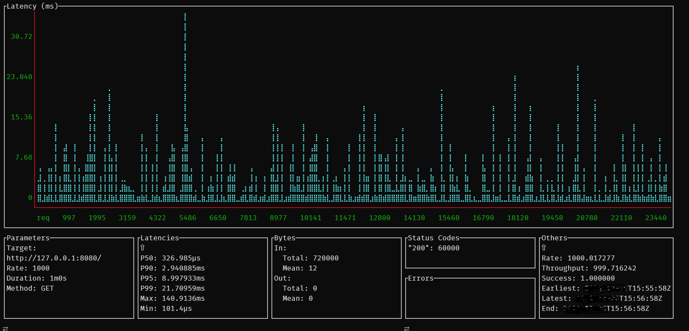
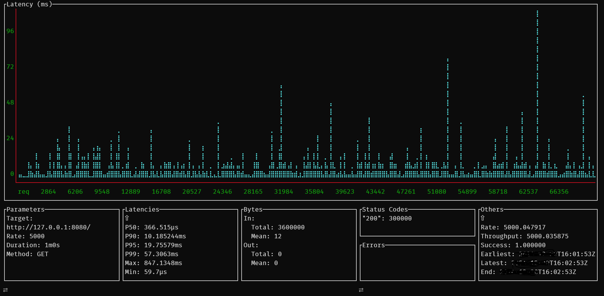

<!--  -->

<p align="center">

</p>

# Http Server

>
> A multithreaded, epoll-driven, object-oriented HTTP server implemented in C++
>


## Build

```bash
./build.sh
```

## Run

To run Server
```bash
./build/HttpServer
```

To connect to server
```
curl http://localhost:8080
```

## Test

Create python virtual environment and activate

> Python 3.12.8 was used at the time of this repo development

```bash
python -m venv .
source bin/activate
```

Install required modules

```bash
pip install -r dev_requirements.txt
```

Run tests 

```bash
cd tests;./test.sh
```


## Benchmarking

### System Info

```bash
Model: Acer Predator
OS: Windows 10
CPU: Intel(R) Core(TM) i5-8300H CPU @ 2.30GHz
```

The server is developed in WSL2.

From `uname -a`

```bash
5.10.102.1-microsoft-standard-WSL2
```

From `cat /etc/os-release`
```bash
NAME="Alpine Linux"
ID=alpine
VERSION_ID=3.20.2
PRETTY_NAME="Alpine Linux v3.20"
```

From `cat /proc/version`
```bash
Linux version 5.10.102.1-microsoft-standard-WSL2 (x86_64-msft-linux-gcc (GCC) 9.3.0, 
GNU ld (GNU Binutils) 2.34.0.20200220) 
```

From `ulimit -a`
```
real-time non-blocking time  (microseconds, -R) unlimited
core file size              (blocks, -c) 0
data seg size               (kbytes, -d) unlimited
scheduling priority                 (-e) 0
file size                   (blocks, -f) unlimited
pending signals                     (-i) 24816
max locked memory           (kbytes, -l) 64
max memory size             (kbytes, -m) unlimited
open files                          (-n) 10000
pipe size                (512 bytes, -p) 8
POSIX message queues         (bytes, -q) 819200
real-time priority                  (-r) 0
stack size                  (kbytes, -s) 8192
cpu time                   (seconds, -t) unlimited
max user processes                  (-u) 24816
virtual memory              (kbytes, -v) unlimited
file locks                          (-x) unlimited
```

## Results using [`wrk`](https://github.com/wg/wrk)

```bash
$ ./wrk --version
wrk 4.2.0 [epoll] Copyright (C) 2012 Will Glozer
```

### 10 Threads / 500 Connections / 60 Seconds
```bash
 ./wrk -t10 -c500 -d60s http://127.0.0.1:8080/
```
```bash
Running 1m test @ http://127.0.0.1:8080/
  10 threads and 500 connections
  Thread Stats   Avg      Stdev     Max   +/- Stdev
    Latency     9.33ms   20.92ms   1.69s    99.04%
    Req/Sec     5.78k     1.21k   14.79k    78.17%
  3446453 requests in 1.00m, 246.51MB read
  Socket errors: connect 0, read 0, write 0, timeout 8
Requests/sec:  57358.28
Transfer/sec:      4.10MB
```

### 10 Threads / 10000 Connections / 60 Seconds

```bash
./wrk -t10 -c10000 -d60s http://127.0.0.1:8080/
```

```bash
Running 1m test @ http://127.0.0.1:8080/
  10 threads and 10000 connections
  Thread Stats   Avg      Stdev     Max   +/- Stdev
    Latency    13.44ms    8.62ms 313.24ms   87.62%
    Req/Sec    11.65k    11.42k   43.38k    80.65%
  4174202 requests in 1.00m, 298.56MB read
  Socket errors: connect 13, read 0, write 0, timeout 0
Requests/sec:  69482.79
Transfer/sec:      4.97MB
```

## Results using [`ali`](https://github.com/nakabonne/ali)

```bash
$ ./ali --version
version=0.7.5, commit=c0aa677, buildDate=2021-11-09T14:53:08Z, os=linux, arch=386
```

```bash
./ali --duration=60s --rate=1000 http://127.0.0.1:8080/
```



```bash
./ali --duration=60s --rate=5000 http://127.0.0.1:8080/
```




## Acknowledgements

+ [Benchmarking Tool : wrk ]()
+ [Benchmarking Tool : ali]()
+ [Http Server Implementation by trungams](https://github.com/trungams/http-server)

